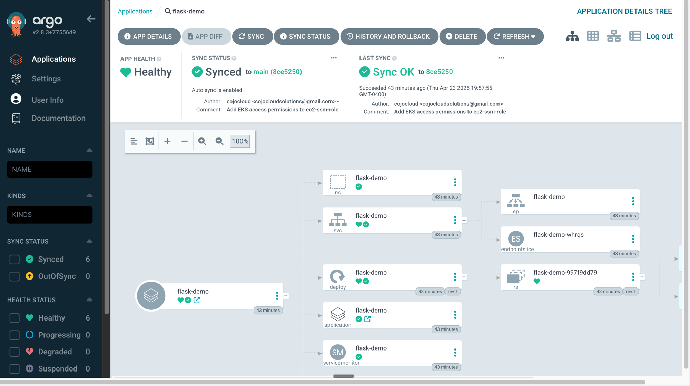
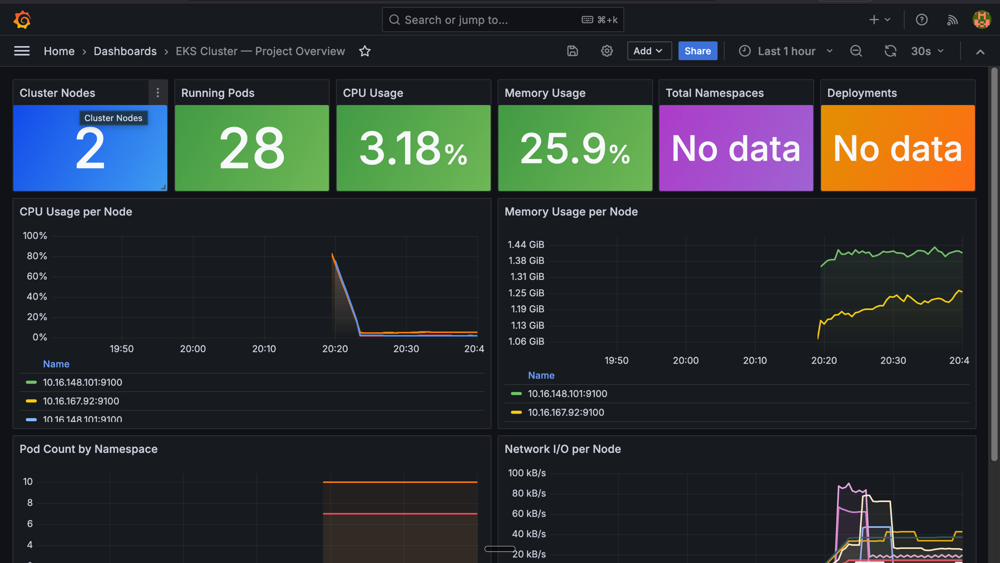
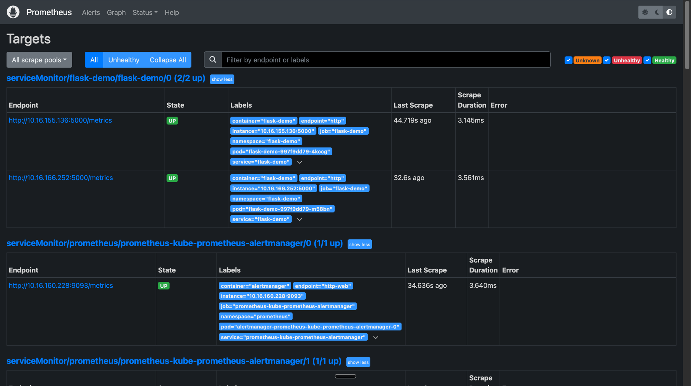

# 🚀 AWS EKS Cluster with ArgoCD, Prometheus, and More - Terraform Project
[](https://www.linkedin.com/in/aman-devops/)
[](https://discord.com/invite/jdzF8kTtw2)
[](https://medium.com/@amanpathakdevops)
[](https://github.com/AmanPathak-DevOps)
[](https://www.serverless.com)
[](https://aws.amazon.com)
[](https://www.terraform.io)

Welcome to the Terraform project repository for setting up a fully functional, private AWS EKS cluster integrated with essential tools like ArgoCD, Prometheus, and Grafana. This repository provides everything you need to deploy and manage a secure and scalable Kubernetes environment on AWS.

## 🌟 Overview

This project automates the provisioning of a private EKS cluster on AWS, along with the deployment of key Kubernetes management and monitoring tools using Terraform and Helm. The infrastructure is designed to be robust, allowing you to easily manage, scale, and monitor your Kubernetes resources.

### Key Features:
- **Private EKS Cluster**: A secure EKS setup running within a private VPC.
- **Infrastructure as Code**: Automated deployment using Terraform, ensuring repeatability and scalability.
- **Helm Integration**: Deployment of ArgoCD, Prometheus, and Grafana using Helm charts.
- **Modular Design**: The project is structured into reusable modules for easier management and customization.

### Architecture Diagram


## 📸 Screenshots

### ArgoCD — flask-demo Application (Healthy & Synced)
> GitOps in action: ArgoCD watches the `k8s/` folder on the `main` branch and automatically deploys all resources. The tree view shows the full application topology — Namespace, Service, Deployment, ReplicaSet, ServiceMonitor — all healthy.



### Grafana — EKS Cluster Overview Dashboard
> Custom dashboard showing live cluster metrics: 2 nodes, 28 running pods, CPU at 3.18%, memory at 25.9%, with per-node CPU/memory time series and network I/O graphs.



### Prometheus — Scrape Targets
> Prometheus targets page confirming the flask-demo ServiceMonitor is active and scraping `/metrics` from both pod replicas (2/2 up) with sub-5ms scrape duration.



## 🚀 Getting Started

### Prerequisites

Before you begin, ensure you have the following installed:

- **Terraform**: Infrastructure as Code tool to automate deployment.
- **AWS CLI**: To interact with your AWS account.
- **Kubectl**: Kubernetes command-line tool.
- **Helm**: Kubernetes package manager.

### Quickstart

1. **Clone the Repository**:
   ```bash
   git clone https://github.com/your-repo/eks-terraform-project.git
   cd eks-terraform-project

2. **Deploy VPC and EC2: Run the following commands to deploy the VPC and an EC2 instance**:
   ```bash
   terraform init
   terraform validate
   terraform plan -var-file=variables.tfvars
   terraform apply -auto-approve -var-file=variables.tfvars

3. **Deploy EKS Cluster and Tools: After setting up the VPC and EC2, run the following commands to deploy the EKS cluster and tools**:
   ```bash
   cd ../eks
   terraform init
   terraform validate
   terraform plan -var-file=variables.tfvars
   terraform apply -auto-approve -var-file=variables.tfvars

4. **Access Deployed Resources: Use kubectl to interact with your EKS cluster and the deployed tools (ArgoCD, Prometheus, Grafana, etc.).**

### 📖 Detailed Guide

For a complete step-by-step guide, including screenshots and detailed explanations, please refer to the [blog post](https://amanpathakdevops.medium.com/). This post covers all the necessary steps to successfully implement this project.

## Contributing
We welcome contributions! If you have ideas for enhancements or find any issues, please open a pull request or file an issue.

## License
This project is licensed under the [MIT License](LICENSE).

## Contact

If you have any questions, suggestions, or feedback, please feel free to join the [Discord Server](https://lnkd.in/dsEdxpst).

---

## Terraform Plan — Errors Encountered and Fixes Applied

The following errors and issues were found and resolved before a clean plan could be produced.

---

### 1. Missing `tls` and `random` provider declarations (`eks/backend.tf`)

**Error** — `terraform init` succeeded but `terraform validate` would have failed at runtime because `module/eks/gather.tf` uses a `data "tls_certificate"` resource and `module/eks/iam.tf` uses `resource "random_integer"`, neither of which had their providers declared in the root `eks/` module.

**Fix** — Added `tls` (`~> 4.0`) and `random` (`~> 3.0`) to `required_providers` in `eks/backend.tf`.

---

### 2. Hardcoded `availability_zone = "us-east-2a"` in EC2 resource (`module/vpc-ec2/ec2.tf`)

**Error** — The EC2 jump server had `availability_zone = "us-east-2a"` hardcoded, conflicting with the `us-east-1` region and the subnet it was being placed in.

**Fix** — Removed the `availability_zone` argument entirely. When `subnet_id` is specified, AWS automatically places the instance in that subnet's AZ, making the explicit argument redundant.

---

### 3. Missing variables in `vpc-ec2/variables.tfvars`

**Error** — Running `terraform plan` from the `vpc-ec2/` directory would fail with `No value for required variable` because five variables declared in `vpc-ec2/variables.tf` were absent from `vpc-ec2/variables.tfvars`: `ec2-sg`, `cluster-name`, `ec2-iam-role`, `ec2-iam-role-policy`, `ec2-iam-instance-profile`, and `ec2-name`.

**Fix** — Added all five missing variable values to `vpc-ec2/variables.tfvars`, matching the values already present in the root `variables.tfvars`.

---

### 4. S3 backend placeholder bucket prevents `terraform init` (`vpc-ec2/backend.tf`, `eks/backend.tf`)

**Error** — Both modules referenced `dev-aman-tf-bucket` (the original author's S3 bucket) as the Terraform state backend. Running `terraform init` against a non-existent or inaccessible bucket causes:
```
Error: Failed to get existing workspaces: S3 bucket does not exist
```

**Fix (permanent)** — Replaced the hardcoded bucket name with `YOUR_S3_BUCKET_NAME` as a clear placeholder. Before running `terraform init` for real, create an S3 bucket in `us-east-1` with versioning and encryption enabled, then substitute the placeholder with your bucket name.

**Fix (for plan preview only)** — To run `terraform plan` without a real S3 bucket, a temporary `override.tf` was added to each module directory to swap the backend to local state:
```hcl
terraform {
  backend "local" {}
}
```
Then `terraform init -reconfigure` was run, followed by `terraform plan`. The `override.tf` files are listed in `.gitignore` and should be removed before deploying for real.

---

### 5. `eks` plan: `no matching EC2 VPC found` / `no matching EC2 Security Group found`

**Error** — Running `terraform plan` in the `eks/` module produced:
```
Error: no matching EC2 VPC found
Error: no matching EC2 Security Group found
```

**This is expected, not a bug.** The `eks` module uses `data` sources to look up the VPC and security group by tag/name. Those resources are created by the `vpc-ec2` module and must exist in AWS before the `eks` plan can complete. This enforces the correct deployment order.

**Resolution** — Always apply `vpc-ec2` before planning or applying `eks`:
```bash
# Step 1 — run from vpc-ec2/
terraform apply -var-file=variables.tfvars

# Step 2 — run from eks/ only after Step 1 completes
terraform apply -var-file=variables.tfvars
```

---

### 6. `eks` plan: warnings about undeclared variables

**Warning** — Passing the shared root `variables.tfvars` to the `eks` module produces warnings like:
```
Warning: Value for undeclared variable
The root module does not declare a variable named "ec2-sg"
```

**This is harmless.** Variables like `ec2-sg`, `ec2-iam-role`, `ec2-iam-role-policy`, `ec2-iam-instance-profile`, and `ec2-name` are vpc-ec2-specific and are simply ignored by the eks module. No action required.

---

## Step-by-Step Deployment Guide

### Phase 1 — Prerequisites
Ensure the following tools are installed and configured before starting:

- **AWS CLI** — configured with valid credentials (`aws configure`)
- **Terraform** — v1.13.x
- **Docker** — installed and logged into DockerHub (`docker login`)
- **kubectl** — Kubernetes CLI

---

### Phase 2 — Create S3 Bucket for Terraform State
Both modules use an S3 backend for remote state. Create the bucket before running `terraform init`.

```bash
aws s3api create-bucket \
  --bucket my-eks-tf-state \
  --region us-east-1

aws s3api put-bucket-versioning \
  --bucket my-eks-tf-state \
  --versioning-configuration Status=Enabled

aws s3api put-bucket-encryption \
  --bucket my-eks-tf-state \
  --server-side-encryption-configuration \
  '{"Rules":[{"ApplyServerSideEncryptionByDefault":{"SSEAlgorithm":"AES256"}}]}'
```

Then replace `YOUR_S3_BUCKET_NAME` in both `vpc-ec2/backend.tf` and `eks/backend.tf` with your bucket name.

---

### Phase 3 — Build and Push Docker Image
Push the application image to DockerHub before the cluster exists so it is ready to pull on first deploy.

```bash
cd app
./build-push.sh latest
cd ..
```

---

### Phase 4 — Deploy VPC + EC2
This creates the networking foundation everything else depends on.

```bash
cd vpc-ec2
terraform init
terraform plan -var-file=variables.tfvars
terraform apply -var-file=variables.tfvars
```

**Resources created:** VPC · 3 public subnets · 3 private subnets · Internet Gateway · NAT Gateway · route tables · security groups · EC2 jump server

---

### Phase 5 — Deploy EKS Cluster + Tools
Run only after Phase 4 is fully complete. The EKS module looks up the VPC and security group by tag — they must already exist in AWS.

```bash
cd ../eks
terraform init
terraform plan -var-file=variables.tfvars
terraform apply -var-file=variables.tfvars
```

**Resources created:** EKS cluster · on-demand and spot node groups · OIDC provider · IAM roles · AWS Load Balancer Controller · ArgoCD · Prometheus · Grafana

> ⚠️ This step takes **15–20 minutes**. EKS cluster provisioning is slow.

---

### Phase 6 — Connect kubectl to the Cluster
The cluster has `endpoint-public-access = false`, meaning the Kubernetes API is only reachable from within the VPC. All `kubectl` commands must be run from the **EC2 jump server** created in Phase 4.

```bash
# SSH into the EC2 jump server
ssh -i your-key.pem ubuntu@<EC2-PUBLIC-IP>

# Configure kubectl from inside the EC2
aws eks update-kubeconfig \
  --name dev-medium-eks-cluster \
  --region us-east-1

# Verify connectivity
kubectl get nodes
```

---

### Phase 7 — Deploy the App via ArgoCD
From the EC2 jump server, apply the ArgoCD Application manifest. ArgoCD watches the `k8s/` folder in this repo and automatically deploys all manifests.

```bash
kubectl apply -f k8s/argocd-app.yaml
```

ArgoCD deploys the following in order:
1. `namespace.yaml` — creates the `flask-demo` namespace
2. `deployment.yaml` — pulls `thiexco/flask-demo:latest` from DockerHub, 2 replicas
3. `service.yaml` — ClusterIP service on port 80
4. `ingress.yaml` — provisions an internet-facing AWS ALB
5. `servicemonitor.yaml` — Prometheus begins scraping `/metrics` every 15s

---

### Phase 8 — Access the App
```bash
# Wait ~2 minutes for the ALB to provision, then get its DNS name
kubectl get ingress -n flask-demo

# Open in browser
http://<ALB-DNS-NAME>
```

---

### Execution Order Summary

```
Phase 1       Phase 2       Phase 3       Phase 4       Phase 5
Prerequisites  S3 Bucket     Docker Push   vpc-ec2       eks
(tools)        (tf state)    (DockerHub)   apply         apply
     │              │              │            │             │
     └──────────────┴──────────────┴────────────┴─────────────┘
                                                              │
                                                         Phase 6
                                                     kubectl config
                                                    (from EC2 only)
                                                              │
                                                         Phase 7
                                                      ArgoCD apply
                                                              │
                                                         Phase 8
                                                        App Live ✅
```

### Key Rules
| Rule | Reason |
|---|---|
| S3 bucket before `terraform init` | Backend needs a real bucket to store state |
| `vpc-ec2` before `eks` | EKS plan looks up VPC and SG by tag — they must exist |
| Docker push before apply | EKS pulls the image on pod creation |
| `kubectl` from EC2 only | Cluster API endpoint is private (VPC-only) |
| ArgoCD apply last | Needs the cluster running to accept the manifest |

---

## Observability Reference — Prometheus & Grafana

### Port-forward all three dashboards

All services use `ClusterIP` and are not exposed externally. Run these from the **EC2 jump server** (or any host with `kubectl` access to the cluster).

```bash
# ArgoCD UI  →  https://localhost:8080
kubectl port-forward svc/argocd-server -n argocd 8080:443

# Prometheus  →  http://localhost:9090
kubectl port-forward svc/prometheus-kube-prometheus-prometheus -n prometheus 9090:9090

# Grafana  →  http://localhost:3000  (admin / prom-operator)
kubectl port-forward svc/prometheus-grafana -n prometheus 3000:80
```

> If you're on the EC2 jump server and want to open the UIs in a local browser, add `-L` SSH tunnels when connecting:
> ```bash
> ssh -i your-key.pem ubuntu@<EC2-PUBLIC-IP> \
>   -L 8080:localhost:8080 \
>   -L 9090:localhost:9090 \
>   -L 3000:localhost:3000
> ```

---

### Prometheus — Verify flask-demo scrape targets

After ArgoCD syncs the `servicemonitor.yaml`, Prometheus should pick up two pod targets.

1. Open **http://localhost:9090/targets** in your browser.
2. Filter by `flask-demo` to confirm both replicas show **State: UP**.

You can also query from the CLI:

```bash
# Confirm targets are being scraped
curl -s http://localhost:9090/api/v1/targets \
  | jq '.data.activeTargets[] | select(.labels.namespace=="flask-demo") | {job:.labels.job, instance:.labels.instance, health:.health}'

# Quick PromQL — total requests in the last 5 minutes
curl -sG http://localhost:9090/api/v1/query \
  --data-urlencode 'query=sum(increase(flask_request_count_total[5m]))' \
  | jq '.data.result'

# 95th-percentile latency per endpoint
curl -sG http://localhost:9090/api/v1/query \
  --data-urlencode 'query=histogram_quantile(0.95, sum by(le,endpoint)(rate(flask_request_latency_seconds_bucket[5m])))' \
  | jq '.data.result'
```

---

### Grafana — Create the EKS Cluster Overview dashboard via REST API

Grafana ships with the default password `prom-operator`. Change it on first login or pass it via the env var below.

```bash
GRAFANA_URL="http://localhost:3000"
GRAFANA_USER="admin"
GRAFANA_PASS="prom-operator"
```

#### 1 — Verify the Prometheus data source is wired up

```bash
curl -s -u "$GRAFANA_USER:$GRAFANA_PASS" \
  "$GRAFANA_URL/api/datasources" \
  | jq '.[].name'
# Expected output: "Prometheus"
```

#### 2 — Create the dashboard via API

The JSON below reproduces the EKS Cluster Overview dashboard (node count, pod count, CPU %, memory %, per-node time series, network I/O).

```bash
curl -s -X POST \
  -H "Content-Type: application/json" \
  -u "$GRAFANA_USER:$GRAFANA_PASS" \
  "$GRAFANA_URL/api/dashboards/db" \
  -d '{
  "dashboard": {
    "title": "EKS Cluster Overview",
    "tags": ["eks","kubernetes"],
    "timezone": "browser",
    "schemaVersion": 36,
    "panels": [
      {
        "id": 1, "type": "stat", "title": "Nodes",
        "gridPos": {"x":0,"y":0,"w":4,"h":4},
        "targets": [{"expr":"count(kube_node_info)","legendFormat":"Nodes","refId":"A"}],
        "options": {"reduceOptions":{"calcs":["lastNotNull"]},"colorMode":"value","graphMode":"none"}
      },
      {
        "id": 2, "type": "stat", "title": "Running Pods",
        "gridPos": {"x":4,"y":0,"w":4,"h":4},
        "targets": [{"expr":"count(kube_pod_info{phase=\"Running\"})","legendFormat":"Pods","refId":"A"}],
        "options": {"reduceOptions":{"calcs":["lastNotNull"]},"colorMode":"value","graphMode":"none"}
      },
      {
        "id": 3, "type": "stat", "title": "Cluster CPU %",
        "gridPos": {"x":8,"y":0,"w":4,"h":4},
        "targets": [{"expr":"100 * (1 - avg(rate(node_cpu_seconds_total{mode=\"idle\"}[5m])))","legendFormat":"CPU %","refId":"A"}],
        "options": {"reduceOptions":{"calcs":["lastNotNull"]},"unit":"percent","colorMode":"value","graphMode":"none"}
      },
      {
        "id": 4, "type": "stat", "title": "Cluster Memory %",
        "gridPos": {"x":12,"y":0,"w":4,"h":4},
        "targets": [{"expr":"100 * (1 - (node_memory_MemAvailable_bytes / node_memory_MemTotal_bytes))","legendFormat":"Mem %","refId":"A"}],
        "options": {"reduceOptions":{"calcs":["lastNotNull"]},"unit":"percent","colorMode":"value","graphMode":"none"}
      },
      {
        "id": 5, "type": "timeseries", "title": "CPU Usage per Node",
        "gridPos": {"x":0,"y":4,"w":12,"h":8},
        "targets": [{"expr":"100 * (1 - rate(node_cpu_seconds_total{mode=\"idle\"}[5m]))","legendFormat":"{{instance}}","refId":"A"}],
        "fieldConfig": {"defaults":{"unit":"percent"}}
      },
      {
        "id": 6, "type": "timeseries", "title": "Memory Usage per Node",
        "gridPos": {"x":12,"y":4,"w":12,"h":8},
        "targets": [{"expr":"100 * (1 - (node_memory_MemAvailable_bytes / node_memory_MemTotal_bytes))","legendFormat":"{{instance}}","refId":"A"}],
        "fieldConfig": {"defaults":{"unit":"percent"}}
      },
      {
        "id": 7, "type": "timeseries", "title": "Network I/O",
        "gridPos": {"x":0,"y":12,"w":24,"h":8},
        "targets": [
          {"expr":"sum(rate(node_network_receive_bytes_total[5m]))","legendFormat":"RX bytes/s","refId":"A"},
          {"expr":"sum(rate(node_network_transmit_bytes_total[5m]))","legendFormat":"TX bytes/s","refId":"B"}
        ],
        "fieldConfig": {"defaults":{"unit":"Bps"}}
      }
    ]
  },
  "folderId": 0,
  "overwrite": true
}'
```

A successful response looks like:
```json
{"id": 1, "slug": "eks-cluster-overview", "status": "success", "uid": "...", "url": "/d/.../eks-cluster-overview", "version": 1}
```

Open the dashboard at **http://localhost:3000/d/&lt;uid&gt;/eks-cluster-overview**.

#### 3 — Useful one-liners

```bash
# List all dashboards
curl -s -u "$GRAFANA_USER:$GRAFANA_PASS" "$GRAFANA_URL/api/search" | jq '.[] | {uid:.uid, title:.title}'

# Export a dashboard to JSON (for version control)
curl -s -u "$GRAFANA_USER:$GRAFANA_PASS" "$GRAFANA_URL/api/dashboards/uid/<UID>" | jq '.dashboard' > dashboard-export.json

# Import a previously exported dashboard
curl -s -X POST \
  -H "Content-Type: application/json" \
  -u "$GRAFANA_USER:$GRAFANA_PASS" \
  "$GRAFANA_URL/api/dashboards/db" \
  -d "{\"dashboard\": $(cat dashboard-export.json), \"folderId\": 0, \"overwrite\": true}"

# Delete a dashboard
curl -s -X DELETE \
  -u "$GRAFANA_USER:$GRAFANA_PASS" \
  "$GRAFANA_URL/api/dashboards/uid/<UID>"
```

---

## Teardown — Destroy All Infrastructure

Teardown must be done **in reverse deployment order**. Skipping steps or reversing the sequence will leave orphaned AWS resources (ALBs, ENIs, security groups) that block VPC deletion.

> All `kubectl` commands must be run from the **EC2 jump server** — the API endpoint is private.

---

### Step 1 — Delete the ArgoCD Application

ArgoCD has auto-sync enabled. If you skip this step, it will recreate Kubernetes resources faster than Terraform can delete them.

```bash
# From the EC2 jump server
kubectl delete -f k8s/argocd-app.yaml

# Confirm it's gone
kubectl get application -n argocd
```

---

### Step 2 — Delete the Ingress (releases the ALB)

The AWS Application Load Balancer is provisioned by the AWS Load Balancer Controller in response to the Ingress resource — it is **not** tracked by Terraform. If the ALB still exists when Terraform tries to destroy the VPC, the destroy will fail because the ALB holds ENIs inside the subnets.

```bash
kubectl delete ingress flask-demo -n flask-demo

# Wait until the ALB is fully deprovisioned (~60s), then confirm
aws elbv2 describe-load-balancers \
  --query 'LoadBalancers[?contains(LoadBalancerName, `flask-demo`) || contains(LoadBalancerName, `k8s-flask`)].LoadBalancerName' \
  --region us-east-1
# Expected: empty list []
```

---

### Step 3 — Destroy the EKS Cluster

This removes the EKS cluster, node groups, Helm releases (ArgoCD, Prometheus, Grafana, AWS Load Balancer Controller), OIDC provider, and all associated IAM roles.

```bash
cd eks
terraform destroy -var-file=variables.tfvars
```

> This step takes **10–15 minutes**. EKS cluster deletion is slow.

When prompted, type `yes` to confirm.

After completion, verify in the AWS console that:
- The EKS cluster is gone
- The node group EC2 instances are terminated
- The ALB controller IAM role is deleted

---

### Step 4 — Destroy the VPC and EC2

Only run this after Step 3 is fully complete. The EKS module creates security group rules that reference the VPC — if the VPC is deleted first, orphaned rules can block future deployments.

```bash
cd ../vpc-ec2
terraform destroy -var-file=variables.tfvars
```

When prompted, type `yes` to confirm.

**Resources deleted:** EC2 jump server · NAT Gateway · Elastic IP · Internet Gateway · route tables · subnets · security groups · VPC · IAM role + instance profile

---

### Step 5 — (Optional) Delete the S3 State Bucket

The Terraform state bucket is not managed by Terraform itself, so it must be deleted manually. Only do this if you are done with the project entirely — deleting it makes the state irrecoverable.

```bash
BUCKET="my-eks-tf-state"   # replace with your bucket name

# Empty the bucket first (versioned buckets require deleting all versions)
aws s3api delete-objects \
  --bucket $BUCKET \
  --delete "$(aws s3api list-object-versions \
    --bucket $BUCKET \
    --query '{Objects: Versions[].{Key:Key,VersionId:VersionId}}' \
    --output json)"

# Delete any leftover delete markers
aws s3api delete-objects \
  --bucket $BUCKET \
  --delete "$(aws s3api list-object-versions \
    --bucket $BUCKET \
    --query '{Objects: DeleteMarkers[].{Key:Key,VersionId:VersionId}}' \
    --output json)"

# Now delete the bucket
aws s3api delete-bucket --bucket $BUCKET --region us-east-1
```

---

### Teardown Order Summary

```
Step 1            Step 2            Step 3            Step 4            Step 5
Delete ArgoCD     Delete Ingress    eks destroy       vpc-ec2 destroy   S3 bucket
Application  ───► (release ALB) ──► (EKS + IAM) ───► (VPC + EC2) ────► (optional)
```

### Why This Order Matters
| If you skip...         | What breaks |
|---|---|
| Step 1 (ArgoCD delete) | ArgoCD re-creates the Ingress; ALB never goes away |
| Step 2 (Ingress delete) | ALB holds ENIs in subnets; `vpc-ec2 destroy` fails with dependency error |
| Doing Step 4 before Step 3 | Security group rules from EKS block VPC deletion |